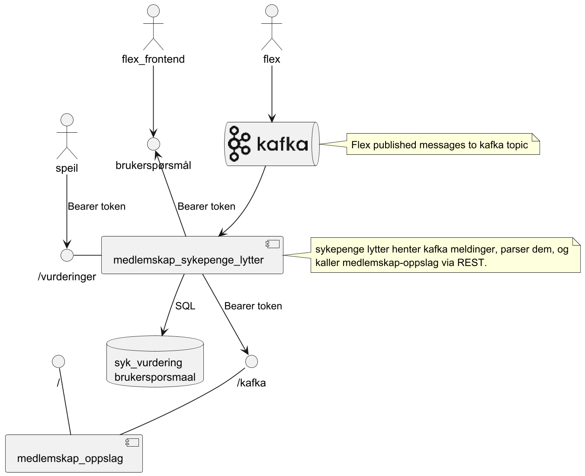
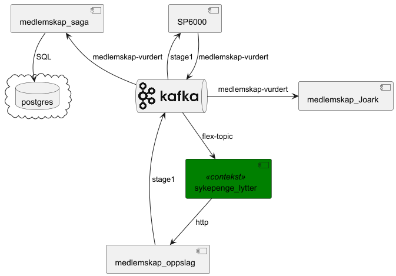

# medlemskap-sykepengerlytter
komponent for lytting på sykepenger-søknad-kafkaTopic


## URL til tjeneste
* preprod: https://medlemskap-vurdering-sykepenger.dev.intern.nav.no/flexvurdering  -- POST
* preprod: https://medlemskap-vurdering-sykepenger.dev.intern.nav.no/brukersporsmal?fom=<dato>&tom=<dato> -- GET
* prod: https://medlemskap-vurdering-sykepenger.intern.nav.no/flexvurdering  -- POST
* prod: https://medlemskap-vurdering-sykepenger.intern.nav.no/brukersporsmal?fom=<>&tom=<>  -- GET

## Autentisering
Forventer et AzureAD-token utstedt til servicebruker, satt Authorization-header (Bearer)

## Azure AD Scope
| Azure scope                                                | Miljø    |
|------------------------------------------------------------|----------|
| api://dev-gcp.medlemskap-sykepenger-listener/.default  | GCP-DEV  |
| api://prod-gcp.medlemskap-sykepenger-listener/.default | GCP-PROD |

## Headere
I tillegg til Authorization-headeren kreves det at Content-Type er satt til application/json
for brukerspørsmål kreves også at fnr er satt i header


## Eksempel request (flexvurdering)
```
{
    "sykepengesoknad_id":"b2b4b4bbddjb4brn3b",
    "fnr":"12345678901",
    "fom":"2022-04-07",
    "tom":"2022-05-03"
}
```
## Eksempel respons (flexvurdering)
```
{
    "sykepengesoknad_id": "bff75jfu7584urkr84ur9",
    "vurdering_id": "123",
    "fnr": "12345678901",
    "fom": "2022-03-10",
    "tom": "2022-04-06",
    "status": "JA"
}
```
# Avhengigheter
* Kafka
* Medlemskap-Oppslag

#UseCase diagram




#Value Chain diagram


